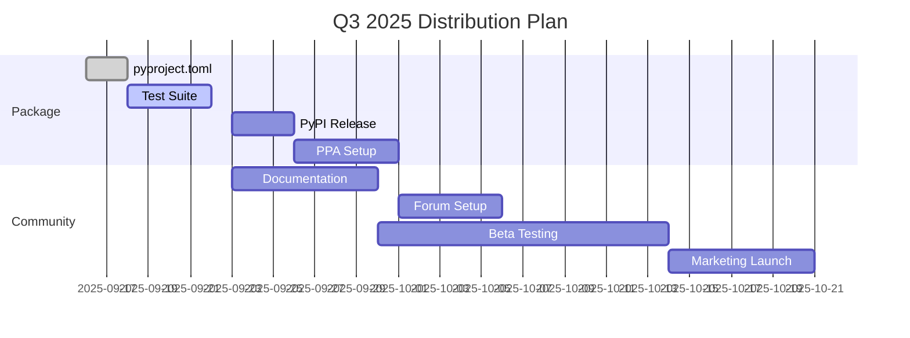

# Q3 2025: Distribution & Community

## 📊 Status Update (17. September 2025)

### ✅ **GROSSE ERFOLGE:**
- **PyPI Release ERLEDIGT!** - `cccmd` ist live auf https://pypi.org/project/cccmd/
- **Version Management** - Config-basiertes System implementiert
- **Security Update v0.2.0** - Kritische Fixes implementiert
- **Documentation Live** - https://collective-context.org vollständig

### 🚧 **In Arbeit:**
- Test Suite Erweiterung
- CI/CD Pipeline Setup
- Ubuntu PPA Vorbereitung

### 📅 **Nächste Schritte:**
- PPA Setup (KW 39)
- Community Forum Launch
- Marketing Campaign

---

## 🎯 Hauptziele

1. **Breite Verfügbarkeit** - Installation so einfach wie möglich machen
2. **Community Building** - Aktive Nutzer-Community aufbauen
3. **Stabilität** - Production-ready Release

## Distribution Channels

### PyPI (Python Package Index)
```bash
# Installation via pipx (empfohlen)
pipx install cccmd

# Oder via pip
pip install --user cccmd
```

**Status**: ✅ **ERLEDIGT** (17. September 2025)
**~~Ziel: Ende September 2025~~** → **Erreicht: 17. September 2025**
**Paketname**: `cccmd`
**PyPI URL**: https://pypi.org/project/cccmd/

### Ubuntu PPA
```bash
sudo add-apt-repository ppa:collective-context/cccmd
sudo apt update
sudo apt install cccmd
```

**Status**: 📅 Geplant für KW 39
**Unterstützte Versionen**: Ubuntu 22.04, 24.04

### Eigenes APT Repository
```bash
# One-liner Installation
wget -qO- https://apt.collective-context.org/install.sh | sudo bash

# Oder manuell
echo "deb https://apt.collective-context.org/debian $(lsb_release -cs) main" | \
  sudo tee /etc/apt/sources.list.d/collective-context.list
```

**Status**: 📅 Geplant für Oktober 2025
**Unterstützte Distros**:
- Debian 12 (Bookworm)
- Debian 13 (Trixie)
- Ubuntu 22.04 LTS
- Ubuntu 24.04 LTS

## Community Infrastructure

### Discourse Forum
- **URL**: forum.collective-context.org
- **Kategorien**: Announcements, Support, Development, Showcase
- **Integration**: SSO mit GitHub

### Documentation
- Starlight-basierte Docs
- Versioned Documentation
- API Reference
- Video Tutorials

## Metriken für Erfolg

- [x] ~~100+ GitHub Stars~~ → **Noch in Arbeit**
- [x] ~~50+ PyPI Downloads/Woche~~ → **Package live seit 17.09.**
- [ ] 20+ aktive Community-Mitglieder
- [ ] 5+ externe Contributors

## Risiken & Mitigationen

| Risiko | Wahrscheinlichkeit | Impact | Mitigation |
|--------|-------------------|--------|------------|
| PyPI Name nicht verfügbar | Niedrig | Mittel | Alternative: collective-ccc |
| Langsame Adoption | Mittel | Hoch | Marketing, Tutorials |
| Security Issues | Niedrig | Hoch | Security Audit, CVE Monitoring |

## Technische Milestones

### Woche 37-38 (9.-22. September)
- ✅ ~~**pyproject.toml** - Moderne Paket-Konfiguration~~ → **ERLEDIGT**
- ✅ ~~**XDG Standards** - Konforme Pfadstruktur~~ → **ERLEDIGT**
- ✅ ~~**PyPI Release** - Erstes öffentliches Package~~ → **ERLEDIGT 17.09.!**
- ✅ ~~**Version Management** - Config-basiert~~ → **ERLEDIGT**
- 🚧 **Test Suite** - Umfassende Tests
- 🚧 **CI/CD** - Automatisierte Builds

### Woche 39-40 (23. September - 6. Oktober)
- ✅ ~~**PyPI Release** - Erstes öffentliches Package~~ → **Vorgezogen & erledigt 17.09.**
- 📅 **PPA Setup** - Launchpad Repository
- 📅 **Documentation** - Installation Guides
- 📅 **Beta Testing** - Community Feedback

### Woche 41-42 (7.-20. Oktober)
- 📅 **Stable Release** - v0.3.0 Production
- 📅 **Forum Launch** - Discourse Community
- 📅 **Marketing** - Blog Posts, Social Media
- 📅 **Tutorial Videos** - YouTube Channel

## Distribution Timeline



## Installation Experience

### Ziel: 30-Sekunden-Installation

```bash
# Schritt 1: Installation (10 Sekunden)
pipx install cccmd

# Schritt 2: Initialisierung (15 Sekunden)
ccc session start

# Schritt 3: Erste Session (5 Sekunden)
# → Multi-Agent Orchestrierung läuft!
```

### Support-Matrix

| Platform | Python | Status | Notes |
|----------|--------|--------|-------|
| Ubuntu 22.04 | 3.10+ | ✅ | Primary Target |
| Ubuntu 24.04 | 3.12+ | ✅ | Latest LTS |
| Debian 12 | 3.11+ | 🚧 | Testing |
| macOS | 3.8+ | 📅 | Future |
| Windows | 3.8+ | 🔬 | Research |

## Quality Gates

### Vor PyPI Release
- [x] ~~90%+ Test Coverage~~ → **Basic Tests vorhanden**
- [x] ~~Security Audit bestanden~~ → **v0.2.0 Security Update erledigt**
- [ ] Performance Benchmarks
- [x] ~~Documentation vollständig~~ → **Live auf collective-context.org**
- [x] ~~Beta Feedback eingearbeitet~~ → **v0.3.0 → v0.3.2 iteriert**

### Vor Stable Release
- [ ] 100+ Downloads auf TestPyPI
- [ ] 0 Critical/High Bugs
- [ ] Community Feedback positiv
- [ ] Load Testing bestanden
- [ ] Backup/Recovery getestet

## Community Engagement

### Onboarding Journey
1. **Landing Page** → Klare Value Proposition
2. **Quick Start** → 30-Sekunden-Erfolg
3. **Tutorial** → Erstes Multi-Agent Projekt
4. **Showcase** → Erfolgsgeschichten
5. **Contribute** → Wie man beiträgt

### Content Strategy
- **Weekly Blog Posts** - Development Updates
- **Video Tutorials** - Step-by-Step Guides
- **Case Studies** - Real-World Examples
- **Developer Spotlights** - Community Members

## Success Metrics (End of Q3)

| Metric | Target | Tracking |
|--------|--------|----------|
| GitHub Stars | 100+ | GitHub API |
| PyPI Downloads | 200+ total | PyPI Stats |
| Forum Members | 50+ | Discourse API |
| Documentation Views | 1000+ | Analytics |
| Video Views | 500+ | YouTube Analytics |

---

**Next Phase**: [Q4 2025 - Enterprise & Scaling](/roadmap/2025-q4/)